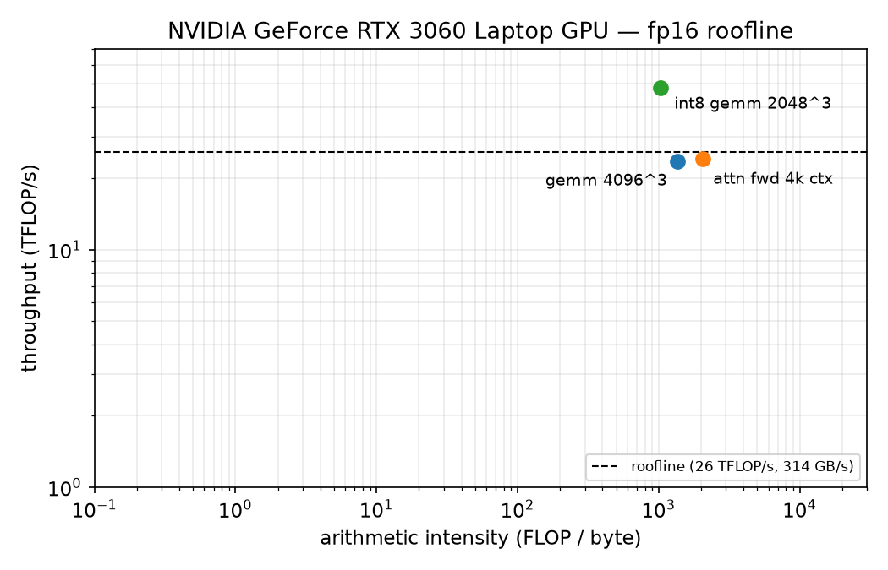
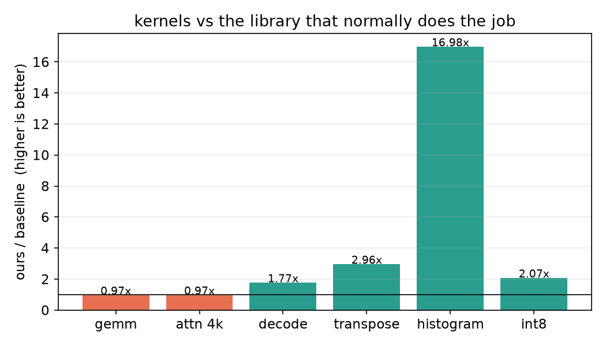

# triton Study Notes

Practice code I worked through alongside the official tutorials; the numbered files 01-25 are my own additions.
Environment: WSL2 + triton 3.8.0. Each file runs directly with `python xx.py` (GPU required) and automatically checks numerics against torch.
File 24 builds a CUDA extension on first run (needs `pip install ninja` and nvcc on PATH). CI is compile-only since github runners have no GPU — the real gate is `python check_all.py`, which runs every file's self-check (27/27 in ~2.5 min on my machine).

## What's written so far

- vector_add / fused_softmax — the first ones typed along with tutorials 01/02; benchmark results for the softmax one are in softmax-performance.png (replicate.py was tutorial 03's exercise, dropped later)
- 01 matmul: tiling + tl.dot, with autotune and L2 swizzle. Lands at 0.8-1.0x of cuBLAS at 4096³ depending on the run (laptop clocks wobble)
- 02 layernorm: first hand-written backward; dW/dB accumulated with atomic_add. Went back over it later: any dtype now (fp16/bf16/fp32), masked for any N, and `_as_2d` checks the strides explicitly instead of letting reshape() copy silently
- 03 flash attention: forward only. Core is online softmax — each K block scanned requires rescaling the old acc by exp(m_old-m_new). Now survives odd seqlen and mixed q/k/v layouts (pitfall 11)
- 04 transpose + persistent kernel: transpose is ~3x faster than torch's x.T.contiguous(), mostly thanks to coalescing
- 05 prefix sum + histogram: associative_scan and two-pass scan; did a comparison experiment for the histogram — with 8 bins, naive atomic takes 1325us, while accumulating in registers first then merging takes only 66us, a 20x speedup
- 06 TMA matmul: replaces manual pointers with TensorDescriptor, so no need to write the K address loop by hand
- 07 fused cross-entropy: streaming logsumexp, no need to materialize the (N, V) intermediate matrix; 3-4x faster than eager at 8192x32K vocab
- 08 add+layernorm fusion, 09 silu*mul (the activation part of swiglu, backward derived by hand)
- 10 RoPE, 11 int8 quantization, 12 MoE routing
- 13 fused adamw: matched against torch.optim.AdamW for 5 steps, error 2e-6
- 14 split-K GEMM: slightly faster than cuBLAS on skinny matrices (16x4096x16384)
- 15 causal flash attention: splits the K loop into left-of-diagonal-block / diagonal-block segments; the right side doesn't need computing at all. Per-tensor offsets + boundary checks now, and the diagonal mask turns out to cover out-of-bounds columns for free (any col past N_CTX is > any valid row, so causal kills it)
- 16 flash-decoding: during decode (q length=1), splits along the KV seq dimension with a two-phase merge; ~1.8x faster than SDPA with a 32K cache
- 17 rmsnorm: the LLaMA-style one, backward derived by hand, verified against torch.nn.functional.rms_norm
- 18 registering kernels as torch custom ops (torch.library.custom_op + register_fake), traceable by torch.compile
- 19 paged attention decode: K/V live in fixed-size pages with a per-sequence block table, virtual-memory style (the vLLM layout); walks the table page by page with online softmax, GQA included. Pairs with 16 — that one split the KV dim across SMs, this one fixes the cache layout
- 20 grouped GEMM for MoE: all experts in one launch. Tokens are pre-sorted by expert so each expert owns a contiguous slice; programs for experts that ran out of tokens exit early
- 21 flash attention backward: both kernels rebuild P from the logsumexp the forward saved; dK/dV and dQ run as two kernels because sharing one would need atomics on dQ. The rowsum(P∘dP) term collapses to rowsum(dO∘O), precomputed in one torch line. Went back and added tail masking for arbitrary seqlen — what I got wrong and then wrong again is pitfall 12
- 22 stream-K GEMM: flattens all (tile, k-iter) work into one list and deals equal chunks to each SM, so the tail wave doesn't strand most of the GPU idle; partial tiles go to a workspace and a small fixup kernel reduces them (deterministic, no atomics). ~6 TFLOPS vs cuBLAS's 20 at 2048³ — dynamic-bound K loops block pipelining, noted in the docstring
- 23 int8 GEMM (W8A8): per-row/per-col symmetric scales, int8 tensor-core dot with exact int32 accumulate, scales folded in at the end. 1.7-2.1x over fp16 on the same shape, ~1.2% of output dynamic range lost
- 24 rmsnorm in CUDA C++ (cuda/rmsnorm.cu, warp shuffle + shared mem reduction): the "without the DSL" version. My float4-vectorized loads turned out no faster than scalar half loads — coalesced is coalesced; numbers in the file
- 25 flash attention as a train-able op: 03's forward + 21's backward inside one autograd.Function, the forward's logsumexp handed straight to the backward. Gradients match SDPA's autograd to ~1e-3; fwd+bwd lands at ~0.8x SDPA's fused path (its backward is far more tuned than mine). Used to assert block-aligned seqlen because 03/21 couldn't mask; assert is gone now
- autotune-sweep.py: brute-forces the config space for the hot kernels (~160 configs, 4-5 min, mostly ptxas), writes autotune-results.csv and prints the winner vs the hardcoded default. The attention sweep is the reproducibility cautionary tale: the first run had a 64-wide tile 1.6-2.3x faster at ctx 1024 (looked like wave quantization) and the wrapper branched on seqlen for it; every clean re-run since put the 128-wide default back on top there, so the branch is gone and one config covers all ctx. The rest came back "default is fine": decode's 8 splits sit within a few % of the best corner at 32k, and the layernorm warp sweep turned into its own reproducibility lesson — the first run said "10x off at N=4096", the re-run said 1%, and the real effect was the opposite direction (too few warps at N=16384 spills registers and runs 100x slow). Everything hardcoded in the kernels is a documented choice now, not vibes
- benchmark.py: one harness for the headline kernels, measures achievable peaks (copy + read probes, min-of-N timing) and plots the roofline + speedup charts. Outputs perf-results.csv / roofline.png / speedup.png
- PROFILING.md: per-kernel roofline analysis — arithmetic intensities worked out by hand, % of measured peak, and what Nsight Compute would tell me next (it doesn't run under WSL2)

## Headline numbers (RTX 3060 laptop, see PROFILING.md for the analysis)

| kernel | ours | baseline | speedup | % of measured peak |
|---|---|---|---|---|
| gemm 4096³ | 01 matmul | cuBLAS | 0.8-1.0x | most of cuBLAS |
| attention fwd, 4k ctx | 03 | SDPA | ~1.0x | ~100% of SDPA |
| decode, 32k cache | 16 | SDPA | 1.7-1.9x | at the measured copy BW |
| transpose 8192² | 04 | torch .T.contiguous() | ~3x | 90-97% of copy BW |
| histogram, 8 hot bins | 05 privatized | 05 naive atomics | 12-17x | — (atomics, not BW) |
| int8 gemm 2048³ | 23 | cuBLAS fp16 | 1.8-2.2x | above fp16 roofline by design |

(generated by benchmark.py; laptop clocks wobble ±10-15% run to run)

## Pitfalls hit along the way (all kept in code comments)

1. `tl.arange` arguments must be constexpr — can't store them in a normal variable and pass them in (bit me in file 10)
2. The nastiest one was in file 15: block pointer `tl.advance` advances a function-local variable, so after splitting the K loop into two segments, the second segment still got the original pointer — the diagonal blocks recomputed the earlier columns. Error was only around 0.1, first mistaken for a precision issue; after much digging it turned out to be double counting. Lesson: pointers shared across "logical segments" in a jit function must either be passed out or the loop shouldn't be split
3. autotune must decorate an @triton.jit kernel; wrapping it around a plain python function raises an arg_names error
4. First version of layernorm backward forgot to multiply by w, making dX completely wrong; also, a histogram written as "per-bin loop with scalar comparison" produces entirely wrong results — it must be written as broadcast comparison
5. For quantization error, don't use relative error — elements with x near 0 blow up in relative terms by definition; compare against the theoretical bound absmax/254 instead
6. File 16 took me the longest: first, q and KV have different plane strides (q is D, KV is N*D) and can't share; second, masked-out k rows produce qk=0 rather than -inf, polluting the softmax denominator; third, the merge formula must not multiply acc by l. Three bugs stacked together gave errors on the order of 1e1
7. I misremembered the silu derivative: dsilu = sig*(1 + x*(1-sig)); the sigmoid derivative is sig*(1-sig), not sig*sig
8. File 19: in the wrapper I set PAGE_SIZE from the block table's width instead of the cache's — two sizes that both look like "pages", and the kernel happily read 32-token "pages" out of 16-token blocks, garbage everywhere. Every size a kernel takes should be traced back to the exact tensor dimension it describes
9. File 22: the B block's start offset is k_off*BK*k_row_stride, and I dropped the stride — no crash, 98% of tiles numerically fine, only the tiles cut at chunk boundaries were garbage. Partially-correct output is way more dangerous than a crash; the only defense was the host-side work decomposition doubling as a test oracle
10. File 24, the CUDA one: my block_sum returned the right value only in lane 0 of warp 0 and everyone else normalized by a partial sum. Both the broadcast AND the "all 32 lanes must enter the shuffle" rule bit me in the same function — shuffles are cooperative, a lane can't opt out
11. The worst bug in the repo, and I only found it because I finally threw strided inputs at file 03: the kernel computed ONE (batch, head) offset from Q's strides and reused it for K, V *and the output*. Works forever when everything is contiguous (the tutorial's world), but hand it a sliced q and the empty_like output — different strides — and Out gets written at Q's plane offsets: wrong values for every plane past (0,0), and for late (batch, head) pairs the offset runs *past the end of the output buffer*. A wrong-answer bug and a silent out-of-bounds write in one, and the old aligned-only self-check could never see it. Each tensor now gets its own offset from its own strides, and there's a regression test with q sliced and k/v contiguous
12. Masking the backward (file 21) surprised me: an out-of-bounds row loads q/do/lse as 0, so pT = exp2(0-0) = 1 — a fake weight of 1 in every OOB column. I was sure that would pollute dK/dV and even wrote it up with an exp2-overflow story before actually testing a version without the P mask — which passed, because every place pT feeds dK/dV also multiplies by the zero-filled do or q. The forward doesn't get this algebraic luck (its softmax denominator sums raw p, file 16's bug), so the -1e6 kill is forward-only. I kept the explicit zeroing at P anyway: free, and it's the invariant a causal backward would need
13. Testing autograd code: cloning a tensor that already requires grad gives a non-leaf, so `.grad` never accumulates on the clone — the reference side of my comparison silently got None. detach() before clone()

## Not yet written

fp8 and TMA-heavy stuff needs a Hopper card, so those wait for hardware. Next up when there's time: folding the activation quantization pass into the previous layer (file 23 calls this out as its main caveat).
make_block_ptr is deprecated in 3.8; the new way is tl.make_tensor_descriptor, with an example in file 06.
